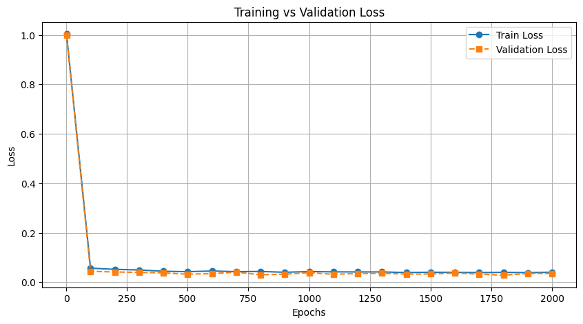
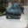
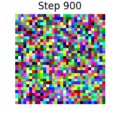
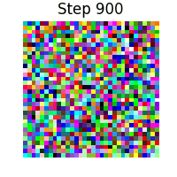
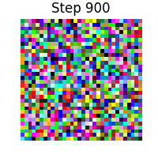
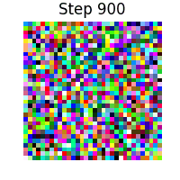
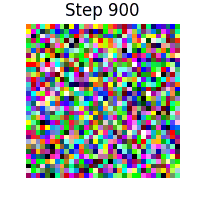
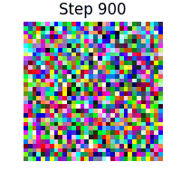
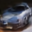
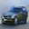

# Building and Training a DDPM Model from Scratch

A PyTorch implementation of Denoising Diffusion Probabilistic Models (DDPM) from scratch, focusing on image generation. This project provides a clean, modular, and well-documented implementation of DDPM with both DDPM and DDIM sampling methods.

> **Note**: If you're interested in the implementation details and references, make sure to check out the Acknowledgments section at the bottom of this README.

## Features

- 🎨 Custom implementation of DDPM with a UNet backbone
- 🔄 Support for both DDPM and DDIM sampling methods
- 📊 Comprehensive training and validation pipelines
- 💾 Automatic checkpointing and model saving
- 🎯 Configurable noise scheduling and diffusion process
- 🚀 Efficient implementation with PyTorch
- 📈 Training progress visualization
- 🎮 Interactive sampling and generation

## Requirements

- Python 3.8+
- CUDA-capable GPU (recommended)
- requirements.txt file (contains all necessary Python package dependencies)

## Installation

1. Clone the repository:
   ```bash
   git clone https://github.com/amirdy/Building-and-Training-a-DDPM-Model-from-Scratch.git
   cd Building-and-Training-a-DDPM-Model-from-Scratch
   ```

2. Install the required dependencies:
   ```bash
   pip install -r requirements.txt
   ```

3. Download and prepare the dataset:
   ```bash
   # Download CIFAR-10 dataset
   python -c "from torchvision.datasets import CIFAR10; CIFAR10(root='./data', download=True)"
   
   # Extract car images
   python extract_cifar10_cars.py
   ```

## Project Structure

```
DDPM-from-Scratch/
├── models/
│   ├── unet.py           # UNet architecture implementation
│   ├── noise_scheduler.py # Noise scheduling logic
│   ├── blocks.py         # Reusable model components
│   ├── linear_attention.py # Linear attention implementation
│   └── ddpm.py          # DDPM model wrapper
├── dataset/
│   ├── dataset.py       # Dataset class implementation
│   └── data_module.py   # Data loading and preprocessing
├── assets/              # Generated samples and visualizations
├── ckpt/               # Model checkpoints
│   ├── best_model.pth  # Best model based on validation loss
│   └── last_model.pth  # Latest model checkpoint
├── config.py           # Configuration parameters
├── main.py            # Training script
├── generator.py       # Generation script
└── trainer.py         # Training logic
```

## Model Architecture

The implementation uses a UNet-based architecture with:
- Residual blocks
- Linear attention mechanisms (instead of standard attetion to reduce both time and space complexity)
- Configurable channel multipliers
- Time embedding (sinusoidal positional embedding)
- Skip connections

## Dataset

The model is trained on the CIFAR-10 car class dataset:
- Training set: 4,250 images
- Validation set: 750 images
- Image size: 32x32 pixels
- Channels: 3 (RGB)

## Usage

### Training

To train the DDPM model with default configurations:
```bash
python main.py
```

The training configuration can be modified in `config.py`:
- Number of epochs
- Learning rate
- Batch size
- Model architecture parameters
- Noise scheduling parameters

### Generation

#### DDPM Sampling
To generate samples using the standard DDPM sampling method:
```bash
python generate.py ddpm
```


#### DDIM Sampling
The DDIM sampling method offers faster generation with fewer steps:
- Uses 50 steps instead of 1000
- Approximately 20x faster than DDPM
- Maintains comparable quality

To generate samples using DDIM:
```bash
python generate.py ddim
```


> **Note**: Before generating samples, make sure you have a trained model checkpoint. The default path is set to "ckpt/last_model.pth" in the generator.py script. You can modify this path in the script if your checkpoint is stored elsewhere.

## Training Results

The model was trained for 2000 epochs on an A40 GPU (approximately 8.5 hours):
- Final training loss: ~0.04
- Final validation loss: ~0.04

Training loss plot:



## Generated Samples

### DDPM Samples
The following are samples generated using the standard DDPM method:

<div align="center">





</div>

### Diffusion Process Visualization
The following GIFs show the gradual denoising process from random noise to the final generated image:

<div align="center">






</div>

### DDIM Samples
The following are samples generated using the DDIM method, which produces similar quality images in fewer steps:

<div align="center">




</div>

## Image Quality Variations

The generated images show varying levels of quality and noise. This is normal and expected in diffusion models.

**Quality Improvement Tips**:
- Train for more epochs
- Increase model capacity
- Use larger training dataset
- Try different noise schedules
- Implement learning rate decay (e.g., cosine annealing) to help the model converge to better minima

## Technical Details

### Configuration Parameters
- Input channels: 3 (RGB)
- Image size: 32x32
- Number of timesteps: 1000
- Beta schedule: Linear from 1e-4 to 0.02
- Learning rate: 1e-4
- Batch size: 64
- Base channels: 64
- Channel multipliers: (1, 2, 4, 8, 16)
- Number of attention heads: 8

## License

This project is licensed under the MIT License - see the LICENSE file for details.

## Acknowledgments

- Original DDPM paper: [Ho et al., 2020](https://arxiv.org/abs/2006.11239)
- DDIM paper: [Song et al., 2020](https://arxiv.org/abs/2010.02502)
- Linear Attention paper: [Transformers are RNNs: Fast Autoregressive Transformers with Linear Attention](https://arxiv.org/abs/2006.16236) by Katharopoulos et al.
- Implementation reference: [The Annotated Diffusion Model](https://huggingface.co/blog/annotated-diffusion) by Hugging Face
  - Provided detailed explanations of the diffusion process
  - Helped with understanding the UNet architecture implementation
  - Guided the implementation of the noise scheduling
