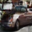
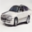

# DDPM-from-Scratch
<div align="center">





</div>

<div align="center">


</div>
This project implements a Denoising Diffusion Probabilistic Model (DDPM) from scratch. DDPMs are a class of generative models that iteratively denoise data starting from pure noise, producing high-quality samples. This repository provides a modular and extensible implementation of DDPM, including training, sampling, and model components.

## Features
- Custom implementation of DDPM with a UNet backbone.
- Noise scheduling and diffusion process.
- Training and validation pipelines.
- Sampling from the trained model to generate images.
- Checkpointing and model saving during training.

## Installation
1. Clone the repository:
   ```bash
   git clone https://github.com/your-username/DDPM-from-Scratch.git
   cd DDPM-from-Scratch
   ```
2. Install the required dependencies:
   ```bash
   pip install -r requirements.txt
   ```
3. Extracts car images dataset:
   ```bash
   python -c "from torchvision.datasets import CIFAR10; CIFAR10(root='./data', download=True)"

   python extract_cifar10_cars.py
   ```
## Dataset

I used the cifar 10 dataset and only the car class.
using 4250 as traning and 750 as valaftion samples.

## Usage
### Training
To train the DDPM model:
```bash
python main.py
```

### Sampling

#### DDPM
To generate samples from the trained model:
```bash
python generate.py
```
Generated images will be saved in the `assets/` folder.

#### DDIM
the DDIM sampling is done using 50 steps(instead of 1000 steps) and my results show that it generates samoek arround 20 timse faster than ddpm. 
See some sample s in the image below:




To generate sample using ddim sampler do this :

```bash
python generate.py
```


## Code Structure
- `trainer.py`: Contains the `Trainer` class, which handles:
  - Training and validation loops.
  - Noise addition using the `NoiseScheduler`.
  - Sampling images from the trained model.
  - Saving the best model checkpoint.
- `models/`: Includes the UNet architecture, noise scheduler, and other building blocks.
  - `unet.py`: Defines the UNet backbone for the DDPM.
  - `noise_scheduler.py`: Implements the noise scheduling logic.
  - `blocks.py`: Contains reusable components like residual blocks and up/down-sampling layers.
  - `linear_attention.py`: Implements linear attention for efficient computation.
  - `ddpm.py`: Wraps the UNet to form the DDPM model.
- `dataset/`: Handles data loading and augmentation.
  - `dataset.py`: Defines the dataset class for loading and preprocessing images.
  - `data_module.py`: Manages data loaders for training and validation.
- `config.py`: Contains configuration parameters for training and model setup.

## What is DDPM?
Denoising Diffusion Probabilistic Models (DDPMs) are generative models that learn to reverse a diffusion process. The diffusion process gradually adds noise to data, and the model learns to denoise it step by step, effectively generating new data samples. For more details, refer to the original paper: [Ho et al., 2020](https://arxiv.org/abs/2006.11239).

## Contributing
Contributions are welcome! Feel free to open issues or submit pull requests.

## License
This project is licensed under the MIT License.
